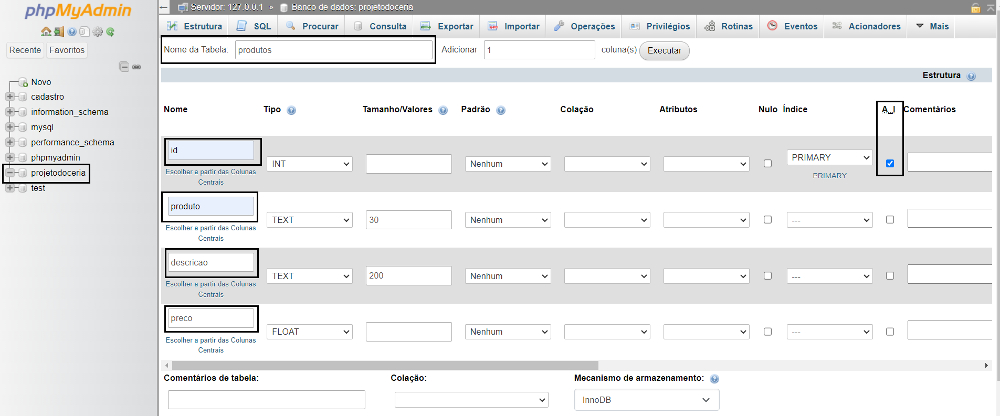
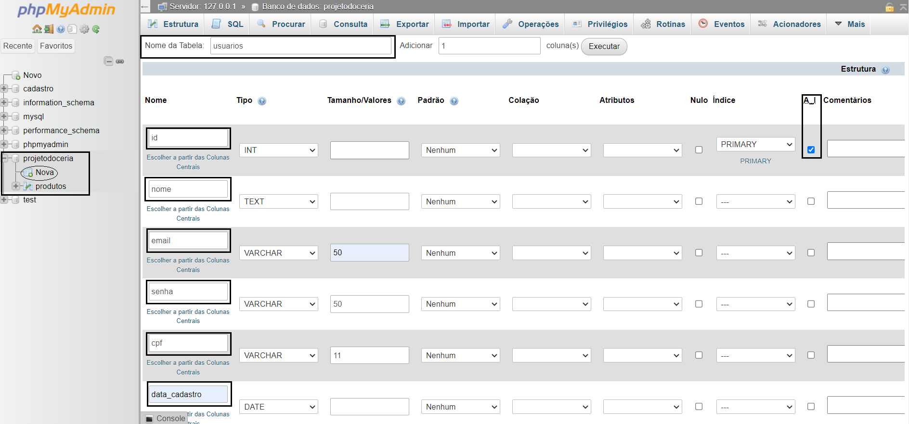
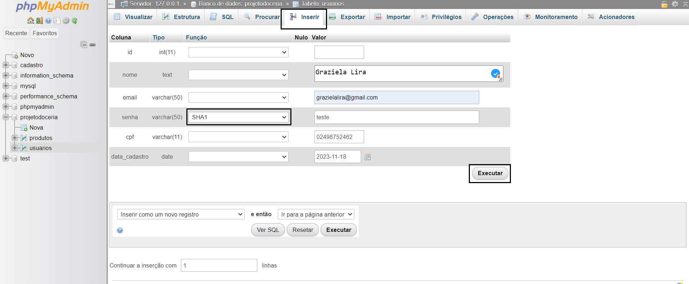

<p align="center">
  </a>
</p>

 #<p align="center">Projeto Doceria</p>

<p align="center">
 <a href="#-sobre-o-projeto">Sobre</a> •
 <a href="#-funcionalidades">Funcionalidades</a> •
 <a href="#-como-executar-o-projeto">Como executar</a> • 
 <a href="#-tecnologias">Tecnologias</a> • 
 <a href="#-autor">Autores</a> • 
</p>

##  💻 Sobre 
Projeto desenvolvido para a disciplina **Programação Web** no curso de *Análise e Desenvolvimento de Sistemas*. Trata-se de uma aplicação web para confeitaria *Doce Appetit* Este projeto visa criar uma experiência online para a confeitaria, com quatro páginas; Início, Catálogos, Sobre Mim e Fale Conosco.
---
## ⚙️ Funcionalidades 
- [x] Realização de login para acessar o painel de administração utilizando e-mail e senha
- [x] Cadastro de produtos no banco de dados
- [x] Listagem de produtos
- [x] Modificação de produtos
- [x] Exclusão de produtos
- [x] Cadastro de novos usuários (administradores)
- [x] Exclusão de usuários (administradores)
- [x] Logout
---
## 🛠️ Como executar
### Pré-requisitos
<br>Instalar o Xampp</br>
-> Link para download: [Xampp] (https://www.apachefriends.org/pt_br/download.html)

### Fazendo download do projeto

Abra um terminal no VSCode e insira o comando abaixo

```bash
$ git clone https://github.com/patriciagrocha/projeto-doceria
```

### 🎲 Rodando o Projeto

<br>Após completar a instalação do Xampp em sua máquina, mova a pasta projeto-doceria para dentro da pasta htdocs, dentro da pasta de instalação do Xampp.</br>
<br>O caminha deverá ser semelhante a esse:</br>


<br>####3º Passo: Iniciar o Apache e o MySQL. Após isso, clicar no "Admin" do MySQL</br>


<br>####4º Passo: Você será redirecionado para página phpmyadmin e lá irá criar um banco de dados chamado "projetodoceria</br>


<br>####5º Passo: Criar uma tabela chamada "produtos" com 4 campos
<br>####6º Passo: Os campos da tabela ‘’produtos” conterão os seguintes nomes e tipos:
<br>-> id- int  - selecione a caixa AUTO_INCREMENT</br>
<br>-> produto – text (30)</br>
<br>-> descricao – text (200)</br>
<br>-> preco – float</br>

<br>-> AO FINAL APERTAR EM SALVAR!!</br>

<br>####7º Passo: Agora que temos um banco de dados e a tabela de produtos. Iremos criar 1 usuário ADMIN, através dele você irá conseguirá acessar o painel de administração pela página de login</br>
<br>####8º Passo: Criar uma tabela chamada "usuarios" com 6 campos</br>
<br>####9º Passo: Os campos conterão os seguintes nomes e tipos:</br>
<br>-> id - int(11) - selecione a caixa AUTO_INCREMENT</br>
<br>->  nome - text</br>
<br>-> email - varchar(50)</br>
<br>-> cpf - varchar(11)</br>
<br>-> data_cadastro - date</br>
<br>-> senha - varchar(50)</br>


<br>-> AO FINAL APERTAR EM SALVAR!!</br>

<br>####10º Passo: O primeiro usuário deverá ser cadastrado da seguinte forma:</br>

<br>P.S. Obrigatoriamente, deverá ser selecionado SHA1 na coluna de função referente à senha.</br>


<br>####11º Passo: Última tabela chamará "formulario" é nela onde as informações obtidas no fale conosco serão armazenadas</br>
<br>####12º Passo: Os campos conterão os seguintes nomes e tipos:</br>
<br>-> nome - varchar(30)</br>
<br>->contato - int(12)</br>
<br>->detalhes - text</br>

<br>-> AO FINAL APERTAR EM SALVAR!!</br>

<br>####13º Passo: Após o cadastro, o primeiro usuário conseguirá acessar o painel administrativo através do e-mail e senha cadastrados no banco:</br>
<br>Para ter acesso basta ser digitado na barra de pesquisa as seguintes informações:</br>
<br>localhost/projeto-doceria/admin/login.php </br>
---

##  Tecnologias  
| Ferramenta | Descrição |
| --- | --- |
| `PHP` |Linguagem de script robusta utilizada para o processamento de dados e lógica de backend no desenvolvimento web.|
| `Bootstrap` |Framework front-end que simplifica a criação de interfaces web responsivas e visualmente atraentes.|
| `Css` |Controlar a apresentação visual, garantindo uma estética coesa nas páginas web.|
| `Trello` |Ferramenta para gerenciamento de projetos|
| `Github` | Hospedagem do código fonte integrado com gerenciador de versionamento|
---
## Autores 
<b>Patrícia Rocha</b>🚀
 <br />
https://img.shields.io/badge/GitHub-100000?style=for-the-badge&logo=github&logoColor=white&link=https://github.com/patriciagrocha

<b>Cristina Neves</b>🌙
 <br />
https://img.shields.io/badge/GitHub-100000?style=for-the-badge&logo=github&logoColor=white&link=https://github.com/anacristinaneves

<b>Graziela Lira</b>🌻
 <br />
https://img.shields.io/badge/GitHub-100000?style=for-the-badge&logo=github&logoColor=white&link=https://github.com/GraziLira

<b>Alan Victor</b>⚓
 <br />
https://img.shields.io/badge/GitHub-100000?style=for-the-badge&logo=github&logoColor=white&link=https://github.com/Alanvictorbs